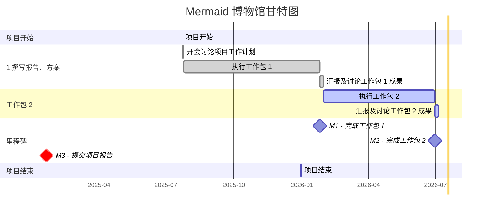
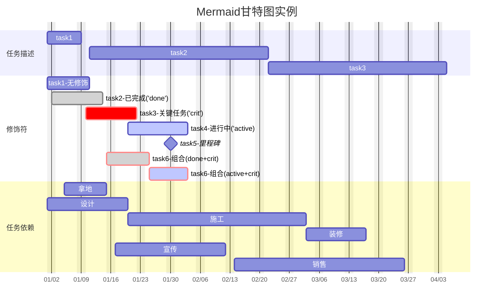

```mermaid  
gantt  
  
title Mermaid 博物馆甘特图  
  
%% 起止日期语法格式  
dateFormat YYYY-MM-DD  
%% 最下方时间轴日期格式  
axisFormat %Y-%m  
%% 最下方时间轴时间间隔  
tickInterval 1month  
%% 表示今天标记的显示样式  
todayMarker stroke-width:3px,stroke:#FBBC05,opacity:0.6  
  
%% 定义任务分类/区  
section 项目开始  
项目开始: done, a0, 2025-07-23, 0d  
  
section 1.撰写报告、方案 
开会讨论项目工作计划: done, a1, after a0, 2025-07-25  
执行工作包 1: done, a2, after a1, 6M  
汇报及讨论工作包 1 成果: done, a3, after a2, 5d  
  
section 工作包 2  
执行工作包 2: active, a4, after a3, 5M  
汇报及讨论工作包 2 成果: active, a5, after a4, 5d  
  
section 里程碑  
M1 - 完成工作包 1: milestone, after a2, 0d  
M2 - 完成工作包 2: milestone, after a4, 0d  
M3 - 提交项目报告: crit, milestone, 2025-01-20, 0d  
  
section 项目结束  
项目结束: active, 2025-12-30, 1d  
```

```mermaid
gantt
  dateFormat  YYYY-MM-DD
  axisFormat %m/%d
  tickInterval 1week
  title       Mermaid甘特图实例
  excludes    weekends
  section 任务描述
    %% 开始/结束时间
    task1: 2022-01-01, 2022-01-09 
    %% 开始时间+长度
    task2: 2022-01-11, 30d 
    %% 只提供长度 默认开始时间为上一行任务的结束时间
    task3: 30d
  section 修饰符
    task1-无修饰 : 2022-01-01, 7d
    task2-已完成('done') : done, 2022-01-02, 10d
    task3-关键任务('crit') : crit, 2022-01-10, 10d
    task4-进行中('active) : active, 2022-01-20, 10d
    %% 里程碑 -- 注意里程碑也需要提供结束时间(可以设置duration=0d)
    task5-里程碑 : milestone, 2022-01-30, 0d
    %% 修饰符可以组合使用
    task6-组合(done+crit) : done, crit, 2022-01-15, 7d
    task6-组合(active+crit) : active, crit, 7d
  section 任务依赖
    %% 给任务起一个代号("nd"), 方便依赖时引用
    拿地: nd, 2022-01-05, 8d
    设计: sj, 2022-01-01, 14d
    %% 依赖多个任务时, 空格分开
    施工: sg, after nd sj, 30d
    装修: zx, after sg, 10d
    宣传: xc, after nd, 20d
    销售: after xc, 30d
```
