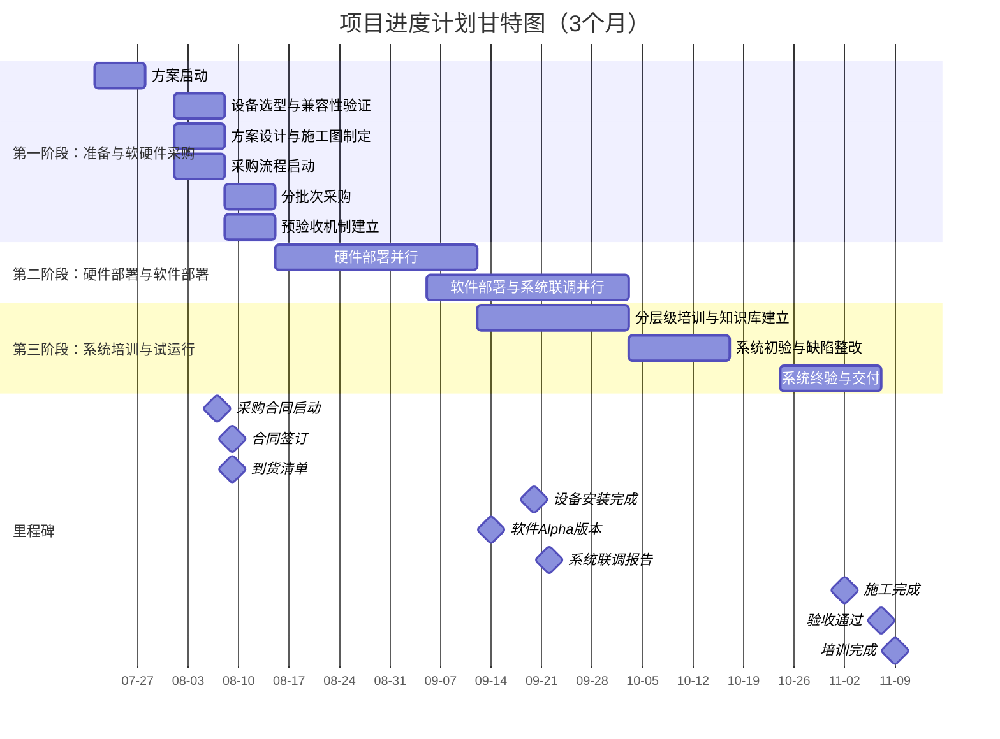
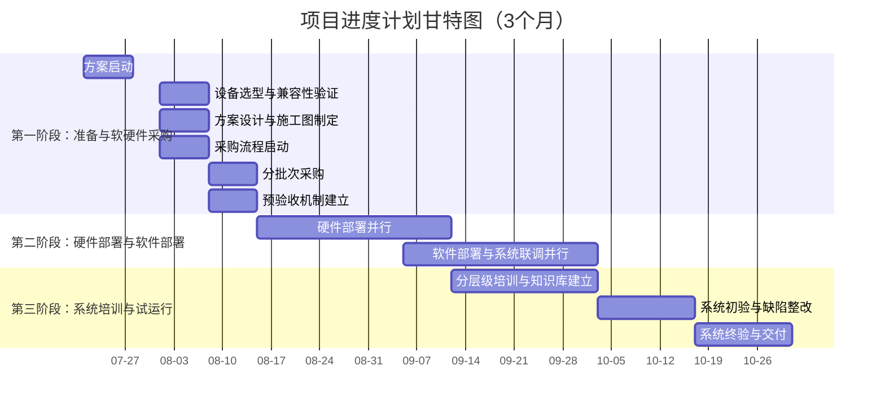

存在问题
一、逆变器等设施发生火灾不能及时发现和及时扑救。
二、监控室夜间无人值班，发生室内火灾时不能及时发现和扑救，人员不能及时疏散。
三、消防水池的水位以及管道压力不能实时监控和超限报警。
四、消防设施的供电状态以及运行状态不能实时监控和故障报警，并无法对消防设施实现远程控制。
五、消防教育培训、消防预案的演练、消防管理制度等流于形式。
六、巡查、检查不规范，且检查内容不能进行统计分析。
七、没有火灾隐患的管理和处置流程。
八、对管理人员应尽的法律责任没有必要的提醒。
九、缺乏火灾风险的分析手段。

改造后拟实现的功能：
一、逆变器等设施发生火灾时能及时自动灭火并将火灾信息上传平台。
二、夜间发生火灾时，能通过移动端及时接收火灾报警信号。
三，通过物联终端感知消防水池的水位以及管道压力并实现超限报警。
四、通过物联设备监控消防设施的供电状态以及停运状态，并能实现远程启停功能。
五、通过平台的管理功能实现对员工的教育培训、消防预案的编制及演练、消防管理制度等消防档案的自动生成。
六、规范巡查检查的内容和频次，并将检查结果自动上传，进行统计分析。
七、通过对消防评估、消防检查巡查、消防维保等各种渠道统计上传的消防隐患，进行统计，并对问题处置形成闭环管理流程。
八，通过“待办事项”提醒，将国家法律法规所规定的职责，提醒到相应的管理人员，实现尽职免责，可通过火灾风险评价体系对类数据进行分析。

2.9.7增加水泵房摄像头
增加 1.2.2 调研情况中 水泵房痛点
增加1.2.3水泵房水淹风险应对拟实现功能

修改点：
增加火灾初期 消控室、变电站逆变器隐患描述
修改隐患中消防工作计划、执行中的用词 柔和，应对解决方案对应章节2.4
增加1.5.2内容里 消控室需求特点与应对方法、增加1.5.3 

修改点：
第一章-概况：
调研部分：细分1.智慧消防管理平台不完善。2.各场站存在的问题或弊端，调研场站需求汇总、需求对应拟改善效果
优化 SWOT分析，删除需求分析，
删除总体目标、突出建设内容
增加环境监测类中草原防火设备、功能
删除建设原则
第二章-功能：
1.项目图的定制模块中增加“草原防火探测和感知”模块
草原防火删除，添加至2.9.10部分 描述2页
第三章-工期：
调整工期为3个月，按比例等缩

修改点：
华能青海分公司消防安全管理平台建设方案-2025.08.08
参数移动到报价前
增加吞火兽描述与清单
去掉无人机、去掉降雨量监测
增加早发现早处理描述
去掉夜间报警，增加全天候报警监测，强调夜间预警部分
去掉SWOT分析
修改1.3 目录级别，去掉设备类层级，直接使用设备层级

1.用传 原青智119 平台对接过来，提供协议（省硬件），否则全换。
2.原液压 增加，配合水位。lora配置难
3.微空间（海南奕明）
4.软件报价按119的4折报给第三方（我们的成本/包含他们的价格）
