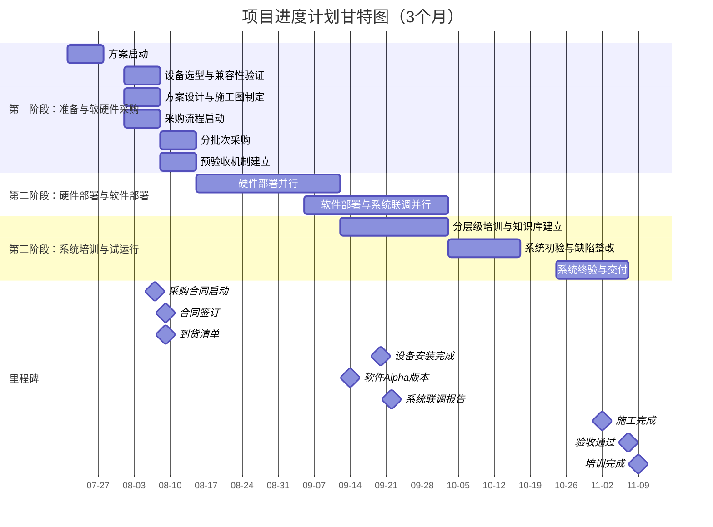
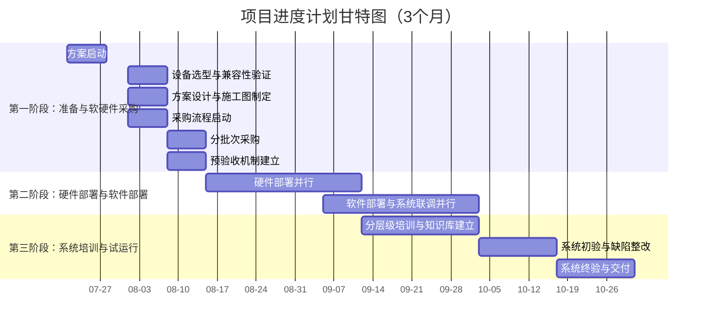

修改点：
增加火灾初期 消控室、变电站逆变器隐患描述
修改隐患中消防工作计划、执行中的用词 柔和，应对解决方案对应章节2.4
增加1.5.2内容里 消控室需求特点与应对方法、增加1.5.3 

修改点：
第一章-概况：
调研部分：细分1.智慧消防管理平台不完善。2.各场站存在的问题或弊端，调研场站需求汇总、需求对应拟改善效果
优化 SWOT分析，删除需求分析，
删除总体目标、突出建设内容
增加环境监测类中草原防火设备、功能
删除建设原则
第二章-功能：
1.项目图的定制模块中增加“草原防火探测和感知”模块
草原防火删除，添加至2.9.10部分 描述2页
第三章-工期：
调整工期为3个月，按比例等缩

修改点：
华能青海分公司消防安全管理平台建设方案-2025.08.08
参数移动到报价前
增加吞火兽描述与清单
去掉无人机、去掉降雨量监测
增加早发现早处理描述
去掉夜间报警，增加全天候报警监测，强调夜间预警部分
去掉SWOT分析
修改1.3 目录级别，去掉设备类层级，直接使用设备层级

1.用传 原青智119 平台对接过来，提供协议（省硬件），否则全换。
2.原液压 增加，配合水位。lora配置难
3.微空间（海南奕明）
4.软件报价按119的4折报给第三方（我们的成本/包含他们的价格）
