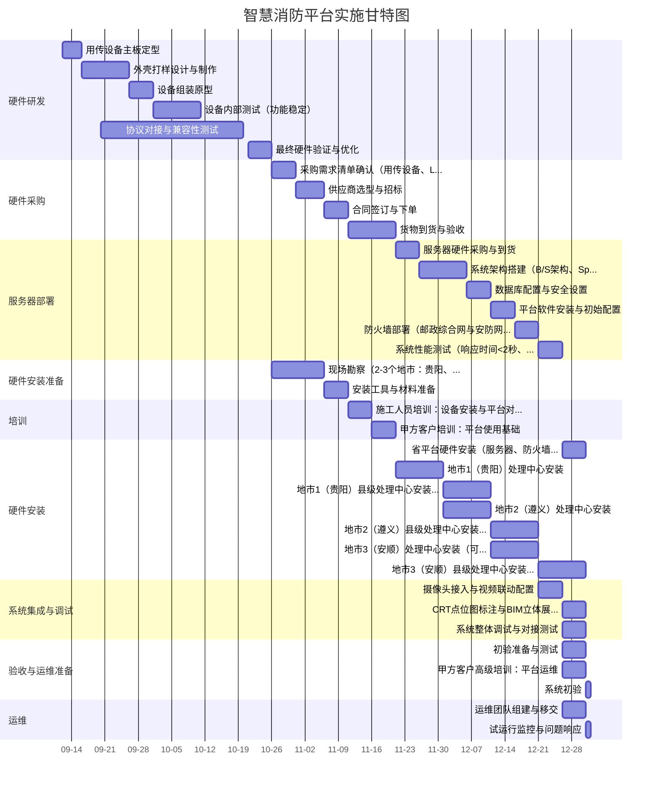

```mermaid 
gantt
    title 智慧消防平台实施甘特图
    dateFormat  YYYY-MM-DD
    axisFormat  %m-%d

    section 硬件研发
    用传设备主板定型 : 2025-09-12, 4d
    外壳打样设计与制作 : 2025-09-16, 10d
    设备组装原型 : 2025-09-26, 5d
    设备内部测试（功能稳定） : 2025-10-01, 10d
    协议对接与兼容性测试 : 2025-09-20, 30d
    最终硬件验证与优化 : 2025-10-21, 5d

    section 硬件采购
    采购需求清单确认（用传设备、L... : 2025-10-26, 5d
    供应商选型与招标 : 2025-10-31, 6d
    合同签订与下单 : 2025-11-06, 5d
    货物到货与验收 : 2025-11-11, 10d

    section 服务器部署
    服务器硬件采购与到货 : 2025-11-21, 5d
    系统架构搭建（B/S架构、Sp... : 2025-11-26, 10d
    数据库配置与安全设置 : 2025-12-06, 5d
    平台软件安装与初始配置 : 2025-12-11, 5d
    防火墙部署（邮政综合网与安防网... : 2025-12-16, 5d
    系统性能测试（响应时间<2秒、... : 2025-12-21, 5d

    section 硬件安装准备
    现场勘察（2-3个地市：贵阳、... : 2025-10-26, 11d
    安装工具与材料准备 : 2025-11-06, 5d

    section 培训
    施工人员培训：设备安装与平台对... : 2025-11-11, 5d
    甲方客户培训：平台使用基础 : 2025-11-16, 5d

    section 硬件安装
    省平台硬件安装（服务器、防火墙... : 2025-12-26, 5d
    地市1（贵阳）处理中心安装 : 2025-11-21, 10d
    地市1（贵阳）县级处理中心安装... : 2025-12-01, 10d
    地市2（遵义）处理中心安装 : 2025-12-01, 10d
    地市2（遵义）县级处理中心安装... : 2025-12-11, 10d
    地市3（安顺）处理中心安装（可... : 2025-12-11, 10d
    地市3（安顺）县级处理中心安装... : 2025-12-21, 10d

    section 系统集成与调试
    摄像头接入与视频联动配置 : 2025-12-21, 5d
    CRT点位图标注与BIM立体展... : 2025-12-26, 5d
    系统整体调试与对接测试 : 2025-12-26, 5d

    section 验收与运维准备
    初验准备与测试 : 2025-12-26, 5d
    甲方客户高级培训：平台运维 : 2025-12-26, 5d
    系统初验 : 2025-12-31, 1d

    section 运维
    运维团队组建与移交 : 2025-12-26, 5d
    试运行监控与问题响应 : 2025-12-31, 1d
```
