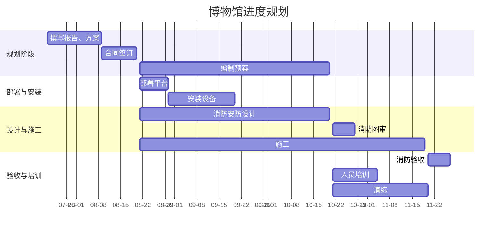
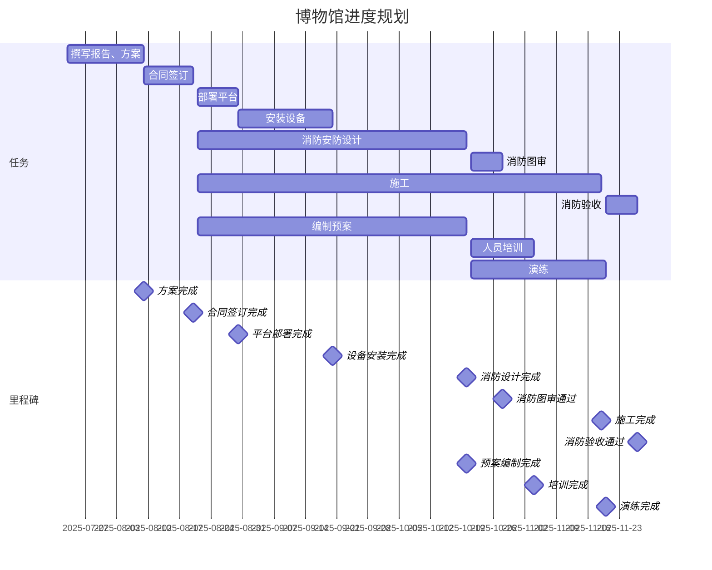

```mermaid  
gantt
    title 博物馆进度规划
    dateFormat YYYY-MM-DD
    axisFormat %m-%d
    tickInterval 7day

    section 规划阶段
    撰写报告、方案 :task1, 2025-07-23, 2025-08-09
    合同签订       :task2, 2025-08-09, 2025-08-20
    编制预案       :task9, 2025-08-21, 2025-10-20

    section 部署与安装
    部署平台       :task3, 2025-08-21, 2025-08-30
    安装设备       :task4, 2025-08-30, 2025-09-20

    section 设计与施工
    消防安防设计   :task5, 2025-08-21, 2025-10-20
    消防图审       :task6, 2025-10-21, 2025-10-28
    施工           :task7, 2025-08-21, 2025-11-19

    section 验收与培训
    消防验收       :task8, 2025-11-20, 2025-11-27
    人员培训       :task10, 2025-10-21, 2025-11-04
    演练           :task11, 2025-10-21, 2025-11-20
```

```mermaid  
gantt
    title 博物馆进度规划
    dateFormat YYYY-MM-DD
    axisFormat %Y-%m-%d

    section 任务
    撰写报告、方案:2025-07-23, 2025-08-09
    合同签订:2025-08-09, 2025-08-20
    部署平台:2025-08-21, 2025-08-30
    安装设备:2025-08-30, 2025-09-20
    消防安防设计:2025-08-21, 2025-10-20
    消防图审:2025-10-21, 2025-10-28
    施工:2025-08-21, 2025-11-19
    消防验收:2025-11-20, 2025-11-27
    编制预案:2025-08-21, 2025-10-20
    人员培训:2025-10-21, 2025-11-04
    演练:2025-10-21, 2025-11-20


    section 里程碑
    方案完成:milestone,2025-08-09,0d
    合同签订完成:milestone,2025-08-20,0d
    平台部署完成:milestone,2025-08-30,0d
    设备安装完成:milestone,2025-09-20,0d
    消防设计完成:milestone,2025-10-20,0d
    消防图审通过:milestone,2025-10-28,0d
    施工完成:milestone,2025-11-19,0d
    消防验收通过:milestone,2025-11-27,0d
    预案编制完成:milestone,2025-10-20,0d
    培训完成:milestone,2025-11-04,0d
    演练完成:milestone,2025-11-20,0d
```
