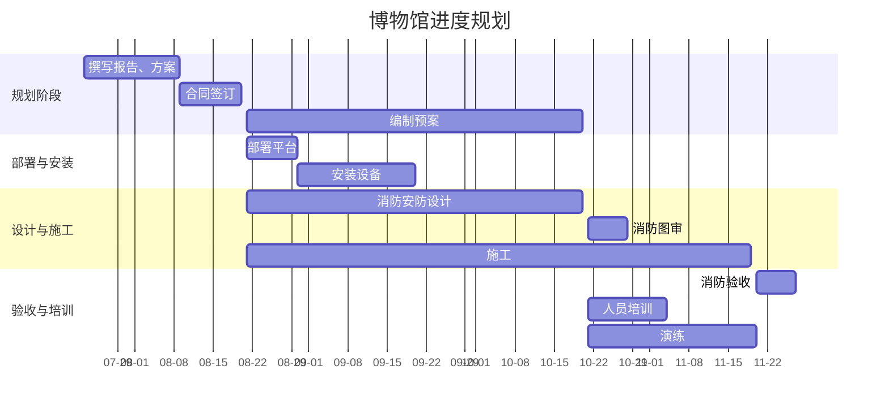
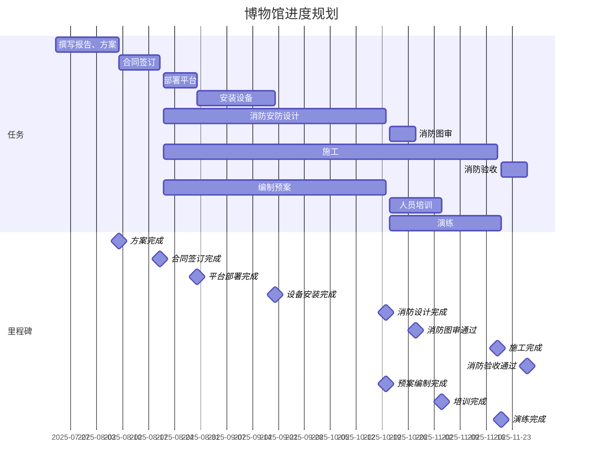

```mermaid  
gantt
    title 华能青海分公司消防安全管理平台建设甘特图
    dateFormat  YYYY-MM-DD
    axisFormat  %Y-%m
    
    section 软件平台部署上线 (49天)
    平台部署启动               :a1, 2025-09-26, 2025-10-09
    平台功能测试及测试环境搭建 :a2, 2025-10-10, 2025-10-23
    设备测试                   :a3, 2025-10-24, 2025-11-06
    准备上线                   :a4, 2025-11-07, 2025-11-13
    
    milestone "系统初步部署完成", 2025-11-13
    
    section 地州市工程实施
    贵阳实施计划 (36天)
    基础数据收集与确认         :b1, 2025-10-01, 2025-10-03
    市级处理中心设备安装       :b2, 2025-10-04, 2025-10-05
    县级处理中心设备安装       :b3, 2025-10-06, 2025-10-09
    金融网点设备安装           :b4, 2025-10-10, 2025-11-05
    
    遵义实施计划 (62天)
    基础数据收集与确认         :c1, 2025-10-10, 2025-10-15
    市级处理中心设备安装       :c2, 2025-10-16, 2025-10-17
    县级处理中心设备安装       :c3, 2025-10-18, 2025-10-22
    金融网点设备安装           :c4, 2025-10-23, 2025-12-05
    
    安顺实施计划 (23天)
    基础数据收集与确认         :d1, 2025-11-01, 2025-11-02
    市级处理中心设备安装       :d2, 2025-11-03, 2025-11-04
    县级处理中心设备安装       :d3, 2025-11-05, 2025-11-06
    金融网点设备安装           :d4, 2025-11-07, 2025-11-23
    
    milestone "地州市基础实施完成", 2025-12-05
    
    section 消防专项部署
    热成像双光谱摄像机安装     :e1, 2025-11-15, 2025-12-15
    LORA系统部署              :e2, 2025-12-16, 2025-12-31
    用户远传对接              :e3, 2025-12-20, 2025-12-31
    
    milestone "系统集成联调完成", 2025-12-31
    
    section 验收与交付
    系统试运行                :f1, 2026-01-01, 2026-01-31
    最终验收                  :f2, 2026-02-01, 2026-02-28
    
    milestone "项目全面交付", 2026-02-28
```
